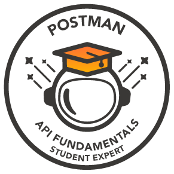
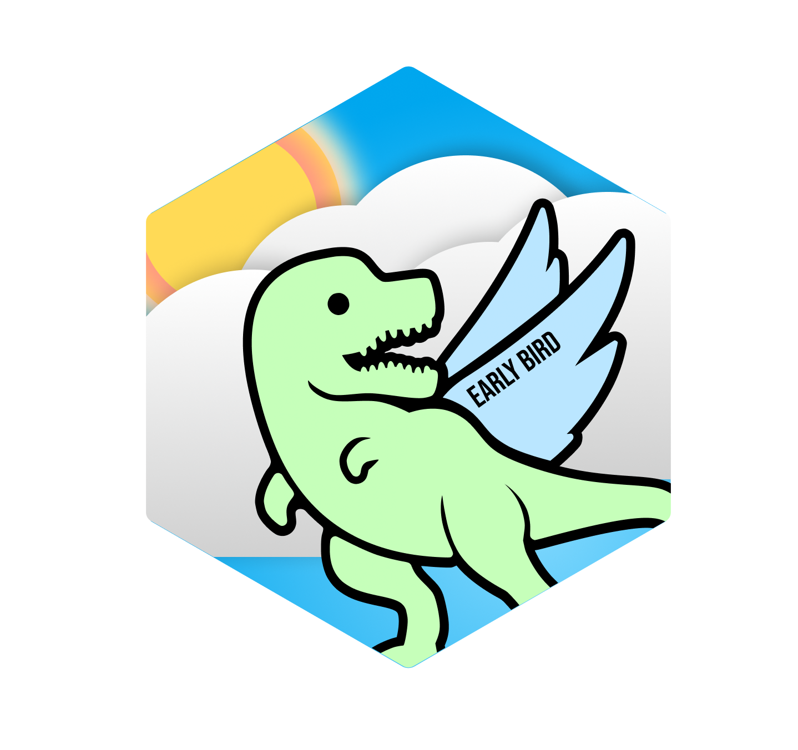
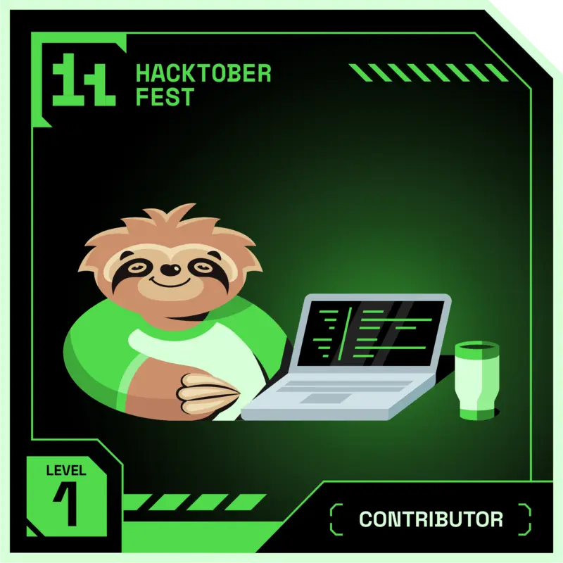
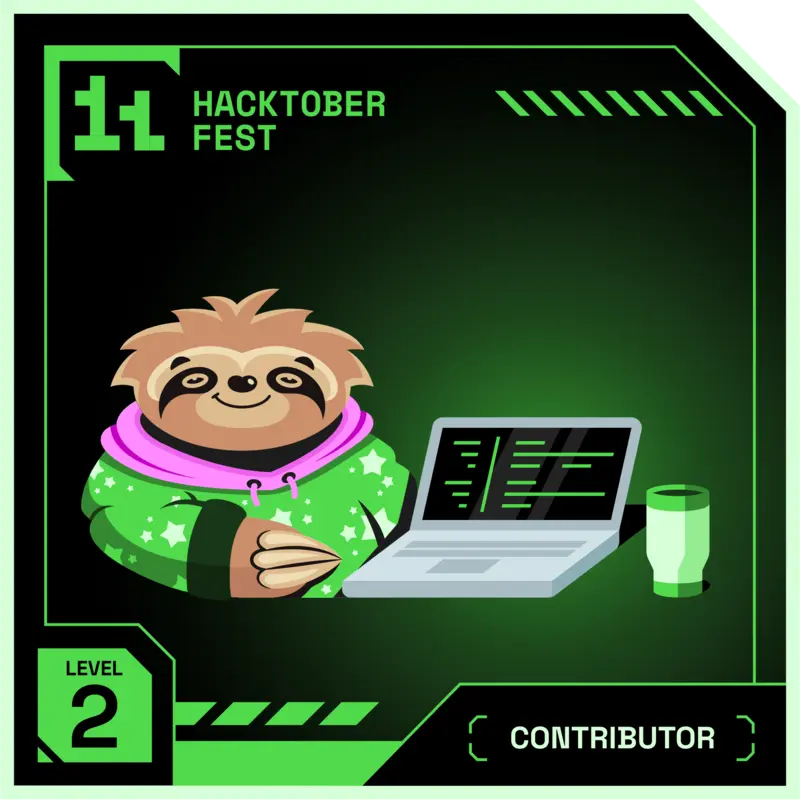
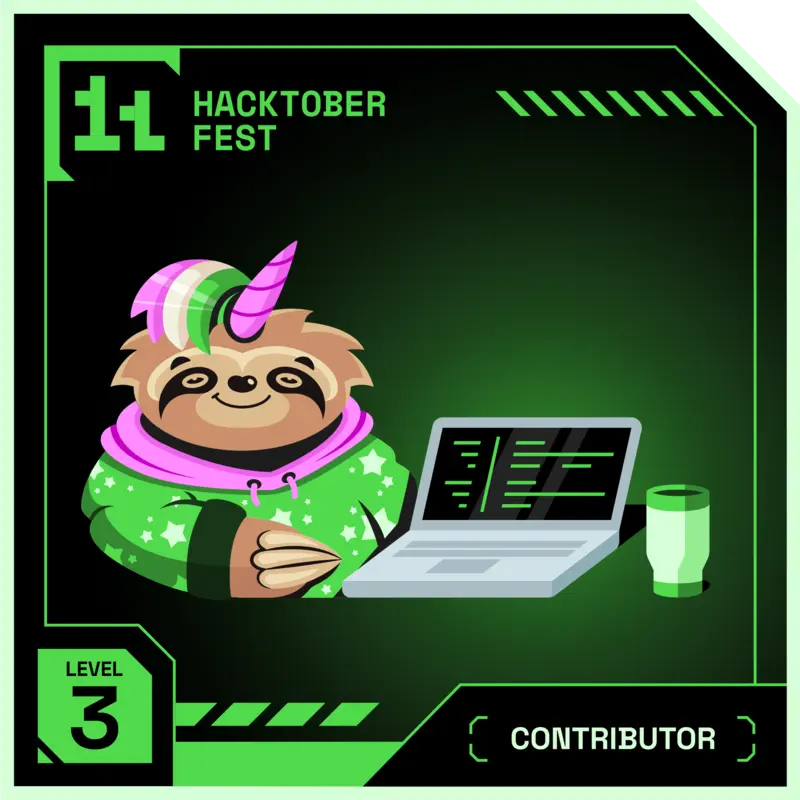

<h1 align="center">Hi 👋, I'm MARKA CHARAN</h1>
<h3 align="center">Aspiring ML Engineer & Web3 Developer</h3>

# 🌫 About Me:
🌱 I’m currently learning TS(TypeScript), Rust. 
👯 I’m looking to collaborate on web3. 
👨‍💻 All of my projects are available at [www.markascharan.me](https://www.markascharan.me) 
💬 Ask me about ReactJs, Web3, and Blockchain. 
📧 How to reach me markascharan@gmail.com

## 🌐 Socials:

# 💻 Tech Stack:

# 🌊 GitHub Stats:
 
 

# 🏆 Badges
      

## 🏆 GitHub Trophies

### ✍️ Random Dev Quote

---

